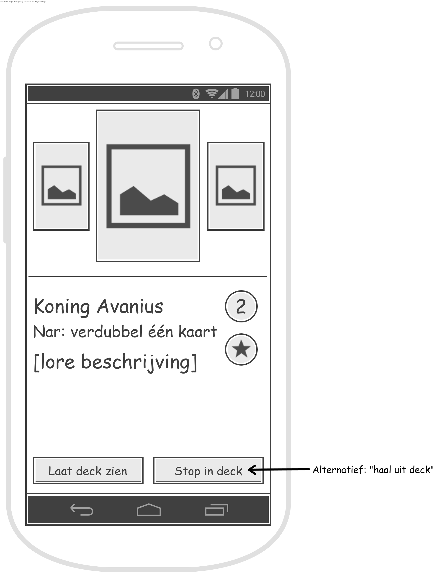

# Sprint 1
Tijdens de eerste sprint heb ik gefocust op de weergave van de beschikbare kaarten in het spel. Hier heb ik lang op
gezeten omdat we als projectgroep een ontwerp hebben gemaakt die we zo nauw mogelijk zouden volgen. Hoe de gebruiker
omgaat het de schermen hadden we nog niet concreet vastgelegd dus daar zat nog ruimte voor verandering in.

Situaties:
- Weergeef de alle beschikbare kaarten.
- Maak de beschikbare kaarten weergave zo dat telkens de weergeven kaart wordt gecentreerd.

---

### Kaarten weergeven
Ik wil de beschikbare kaarten weergeven op het scherm en om dit voor elkaar te krijgen, heb ik keuze uit verschillende
elementen. Het doel was om de kaarten horizontaal te kunnen schuiven zodat de gebruiker door zijn aantal
beschikbare kaarten kan scrollen en de informatie kan zien van elke kaart. Om dit te realiseren heb ik de keuze uit
de volgende UI elementen.

##### Ontwerpkeuzes
- **ScrollView:** Ik kan kiezen uit een horizontale ScrollView. Een voordeel is dat het gemakkelijk te implementeren
is, maar een groot nadeel is dat je de style niet veel kan aanpassen waardoor het niet zo zeer mooi kan maken.
- **RecyclerView:** Met een RecyclerView kan je al veel meer dan met een ScrollView, maar het is ook lastiger te
implementeren. Ondanks dat we het tijdens de lessen hebben behandeld, begreep ik de code achter de RecyclerView nog
niet helemaal.
- **Meerdere ImageViews:** met drukknoppen waarmee je de kaarten kan updaten. Je zet een kaart in het midden en twee
kleinere kaarten aan beide kanten van de middelste kaart welke ook als een knop functioneren. Om het moment dat je
op één van die kleinere kaarten drukt, worden de ImageViews geüpdate met de juiste kaart om te weergeven.

##### Gekozen ontwerp
Na gedacht te hebben over de meerdere ImageViews met knoppen heb ik toch gekozen voor de RecyclerView. De ScrollView
viel in elk geval af omdat dit te simpel was en omdat ik niet het gewenste resultaat kon bereiken, namelijk de grote
kaart in het midden en de twee kleine kaarten aan de zijkant. En de meerdere ImageViews viel af omdat de gebruiker
dan niet horizontaal kan sliden, maar alleen kan drukken op het scherm. Dit is vrij gebruikers onvriendelijk dus om
deze reden heb ik voor de RecyclerView gekozen. Daarnaast hebben we de RecyclerView behandeld in de Android
programmeerlessen en wordt het gezien als een goede praktijk om te gebruiken in het geval dat je een grote lijst hebt
die je ook tussendoor wilt updaten. Na enkele uren was het mij gelukt om afbeeldingen te weergeven met behulp van
een RecyclerView.

---

### Kaarten contreren
Met een werkende RecyclerView had ik slechts het begin. Nu wilde ik dat de kaarten mooi gecentreerd worden alleen
zulke animaties hadden we niet behandeld tijdens de programmeerlessen. Hiervoor moest ik dus ook onderzoek doen en
na een tijdje had ik een oplossing gevonden.

##### Ontwerpkeuzes
Ik had slechts één oplossing gevonden die werkte met een RecyclerView. Ook was er de oplossing om alsnog een andere
ontwerpkeuze te maken in de vorige situatie ("kaarten weergeven"), maar hier had ik mijn afwegingen al goed gemaakt.
- Ik kan gebruik maken van Google's ViewPager om de kaarten goed te centreren. Een voordeel was dat hier veel
informatie over was te vinden omdat het al sinds 2012 (?) werd uitgebracht.
  - Binnen de ViewPager kan ik gebruik maken van Fragments. Dit onderwerp hadden we alleen niet in de Android
  programmeerlessen behandeld en op het oog leek het vrij lastig om het te begrijpen.
  - Binnen de ViewPager kan ik gebruik maken van een eigen onboardingItem in plaats van de Fragments.

##### Gekozen ontwerp
Ik had al redelijk wat tijd gestoken in het zoeken en begrijpen van een oplossing om de kaarten te centreren, dus ik
besloot om verder te gaan met Google's ViewPager. Hierbij had ik gekozen voor een eigen onboardingItem want zo had ik
het ook gemaakt met de RecyclerView. Daarnaast begreep ik weinig van de Fragments afgezien van dat dit de pagina's
waren van de ViewPager.

Helaas kwam ik snel vast te zitten omdat meerdere tutorials niet werkte in mijn project of ze waren geschreven in
Kotlin. Helaas strandde hier mijn dag, met een werkende RecyclerView maar een niet-werkende ViewPager.

---

### Reflectie
Achteraf vond ik dat ik te weinig kennis had van de RecyclerView. Ik had hier meer mee moeten oefenen omdat ik hier
toch wel wat tijd mee had verloren. Daarna kwam de ViewPager en was vrij vergelijkbaar met de RecyclerView maar om
een onbekende reden heb ik het niet werkend gekregen. Ik heb anderen ook niet om hulp gevraagd omdat ik hen niet wilde
lastig vallen met mijn problemen. Dit had ik anders moeten aanpakken, namelijk om wel gewoon om hulp te vragen of op
z'n minst om een ander perspectief.

#### Navigatie
[Index](../readme.md) / **Sprint 1** / [Sprint 2](sprint2.md) / [Sprint 3](../week7/sprint3.md)
/ [Sprint 4](../week7/sprint4.md) / [Stelling reflectie](../overig/stelling-reflectie.md) / [JSON applicaties](../overig/json-applicaties.md)