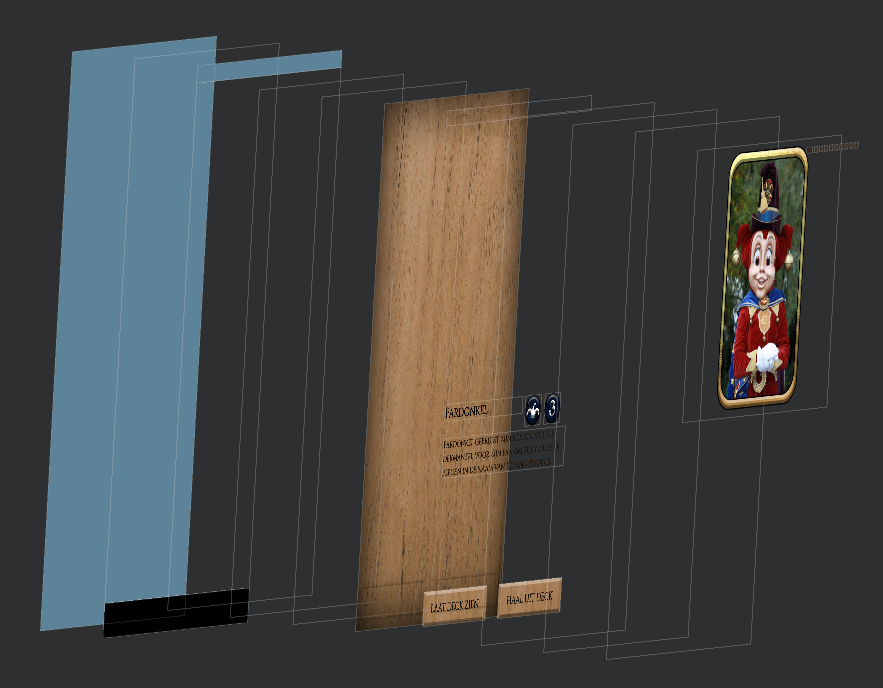
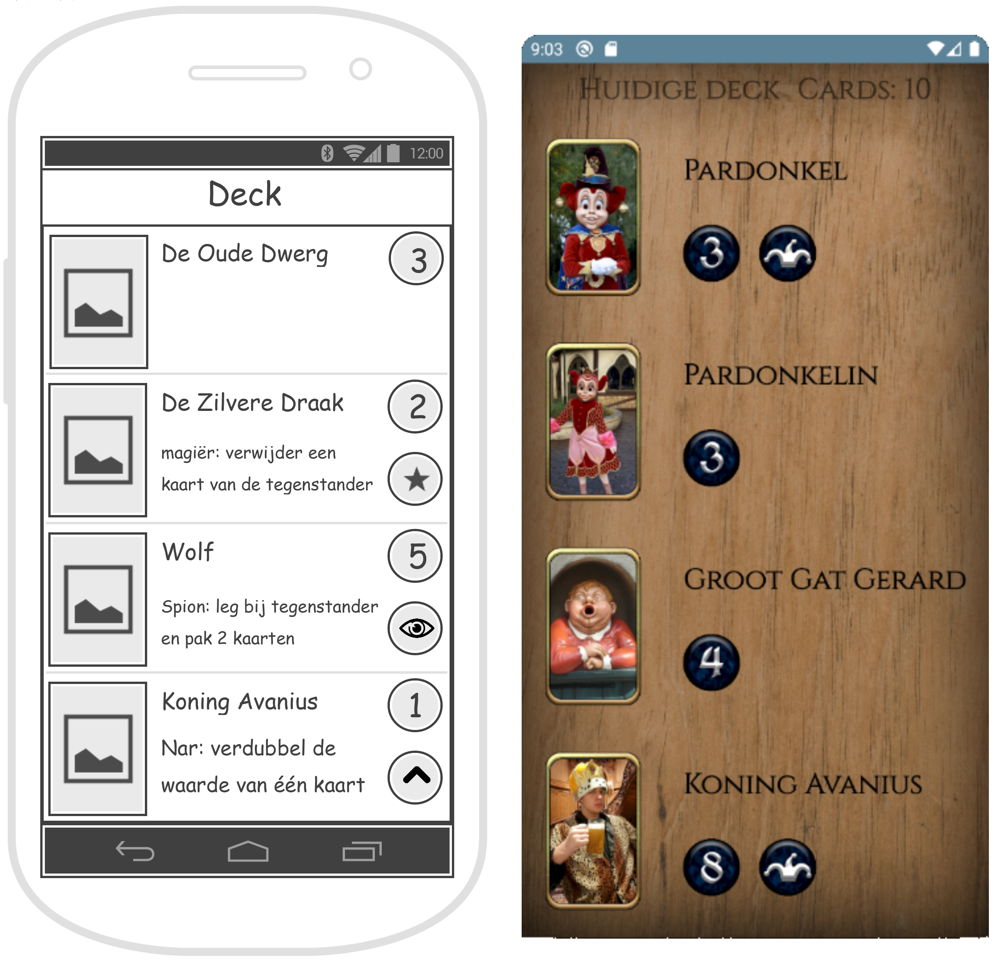

# Sprint 3
Tijdens de derde sprint ben ik aan de slag gegaan met de koppeling van data. Hiervoor heeft Twan (groepsgenoot)
een DataStore klasse gemaakt waarvan iedereen gebruik kan maken. Tijdens deze sprint heb ik deze twee voornamelijk
grote ontwerpkeuzes moeten maken.
- Hoe kan de gebruiker kaarten in en uit zijn Deck halen?
- Waar op het scherm kan de gebruiker allemaal de kaarten verschuiven?

---

### Deck opbouwen
Eerder, tijdens het maken van het ontwerp in een draaddiagram, had ik besloten om de kaarten in het deck te stoppen en
uit het deck te halen door middel van een knop. Alleen tijdens het programmeren zat ik er aan te denken om het mooier
te maken. Op dit moment moest ik dus deze ontwerpkeuze heroverwegen.

##### Ontwerpkeuzes
1. Behoudt de knoppen waarmee je de kaart in en uit je deck kan plaatsen/halen.
2. Maak de kaarten drukbaar zodat je op de kaart kan drukken om hem in en uit je deck te plaatsen/halen. Hierbij zal de
kaart oplichten of dof gekleurd worden.

##### Gekozen ontwerp
Ik wilde eigenlijk heel graag de kleur-veranderende kaart methode gebruiken om de kaarten in en uit het deck te
plaatsen/halen, maar tijdens de tweede sprint had ik vrij veel moeite met het toevoegen van animaties aan de
RecyclerView. Ook heb ik het even overlegd met mijn projectgroep en samen besloten we om de drukknop te houden zodat
de kaarten ook normaal gekleurd blijven en de gebruiker altijd de kaart goed kan zien. Tevens is het drukken op de kaart
een onzichtbare actie voor de gebruiker, waarmee ik bedoel te zeggen dat als de gebruiker niet weet dat hij op de kaart
kan drukken, hij nooit het deck zal kunnen aanpassen.

---

### Grootte van de ViewPager2
Je kan een kaart alleen verschuiven als je binnen het kader van de ViewPager2 drukt en je vinger verplaatst. Dit
betekent dat, wanneer de RecyclerView halverwege het scherm stopt omdat de kaart alleen op de bovenste helft weergeven
moet worden, de gebruiker alleen op de bovenste helft kan interacteren om de kaart te verschuiven. Hiervoor moest
ik dus een keuze maken in het ontwerp van het scherm (XML layout).

##### Ontwerpkeuzes
- Behoudt het ViewPager2 kader grootte slechts bovenaan het scherm. Het klein voordeel is dat het in Android Studio
overzichtelijker is waar het element zit. Dit is echter geen voordeel voor de gebruiker van de app. Een groot nadeel
is dat de gebruiker slechts met de bovenste helft van het scherm de kaarten kan verschuiven.
- Het ViewPager2 kader wordt vergroot naar het gehele scherm waardoor de gebruiker het gehele scherm kan gebruiken om
de kaarten te verschuiven. Een klein nadeel is dat het XML layout in Android Studio hierdoor onoverzichtelijker wordt.

##### Gekozen ontwerp
Uiteraard had ik gekozen om de ViewPager2 te vergroten naar het gehele scherm. Hierbij moest ik wel goed nadenken over
de lagen die zich bevinden op de XML layout. Namelijk als er zich andere elementen bovenop de ViewPager2 bevinden dan
kan je niet interacteren met de ViewPager2 op de plekken waar deze elementen zich bevinden. Dit is een handige
mechaniek waarvan ik gebruik kon maken, want ik wilde dat de drukknoppen onderaan het scherm wel over de ViewPager2
zouden zitten zodat daar de ViewPager2 niet werkte en de drukknoppen wel. En de teksten met informatie over de kaart
zou achter de ViewPager2 moeten zitten zodat deze niet de werking van de ViewPager2 zouden verstoren. Dit is te zien
in de breakdown gemaakt door Android Studio's Layout Inspector. Zie de afbeelding hieronder.

---

### Reflectie
Tijdens deze derde sprint heb ik weinig ontwerpkeuzes gemaakt dat te maken had met de opbouw van de programmacode. Ik
heb vooral ontwerpkeuzes gemaakt in de XML layout. Uiteraard heb ik ook veel programmacode geschreven maar dit was
vooral het koppelen van de data uit de DataStore met het deck. En ook heb ik een nieuwe activity gemaakt waarin je
kan zien welke kaarten momenteel in de gebruikers zijn deck zitten, en hoeveel kaarten dit zijn. Maar hiervoor hoefte
ik geen ontwerpkeuzes te maken omdat we vooraf de sprints al een ontwerp hadden gemaakt in Visual Paradigm
draaddiagrammen. Het draaddiagram van dit scherm zie je in de afbeelding hieronder. In de gerealiseerde activity
zijn slechts twee afbeeldingen naar een andere plek verplaats om zo meer ruimte te maken voor de naam van het figuur
(kaart) maar zo'n ontwerpkeuze vind ik niet noemenswaardig om uitgebreid te onderbouwen.

#### Navigatie
[Index](../readme.md) / [Sprint 1](../week6/sprint1.md) / [Sprint 2](../week6/sprint2.md) / **Sprint 3**
/ [Sprint 4](sprint4.md) / [Stelling reflectie](../overig/stelling-reflectie.md) / [JSON applicaties](../overig/json-applicaties.md)