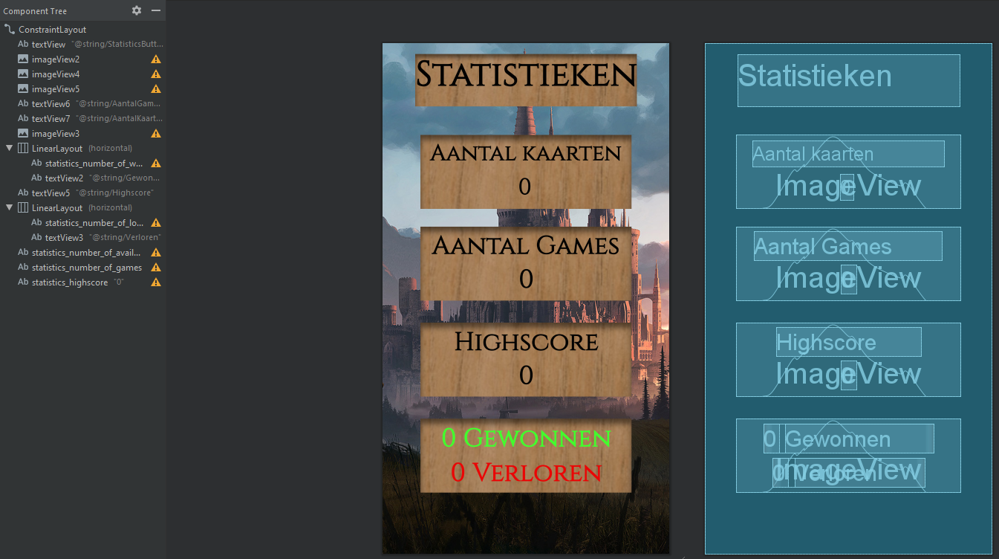

# Sprint 4
In de vierde en tevens laatste sprint heb vroeg in de ochtend de deck activities en XML layouts volledig gemaakt en
alle bugs verholpen. Enkele bugs waren bijvoorbeeld dat de knop waarmee je de kaart in en uit het deck kan
plaatsen/halen het opeens niet meer deed. Na het verhelpen van deze bugs ben ik aan de slag gegaan met met robuster
maken van de applicatie en de statistieken activity.

---

### Min. en max. aantal kaarten in deck
Volgens de spelregels van Essteling: The Card Game moet je minimaal 10 kaarten en mag je tot 15 kaarten in je deck
hebben. Er waren meerdere manieren mogelijk om deze restrictie in de app te krijgen, namelijk ... (zie ontwerpkeuzes)

##### Ontwerpkeuzes
1. Plaats de restrictie rondom de knop waarmee je de kaarten in en uit het deck plaats/haalt.
2. Plaats de restrictie rondom de terug knop zodat je niet het deck scherm kan verlaten zolang je niet (10 >= x <= 15)
kaarten in je deck had zitten.
3. Plaats de restrictie rondom de knop waarmee je het spel start.

##### Gekozen ontwerp
Deze drie ontwerpkeuzes waren allemaal mogelijk, maar niet allemaal waren even gebruikersvriendelijk. Uiteindelijk had
ik gekozen om d erestrictie te plaatsen rondom het spel start knop. Deze keuze had ik gemaakt op basis van de nadelen
die de andere ontwerpen hadden. Het eerste ontwerp had het nadeel dat, in het geval je al 15 kaarten in je deck hebt
zitten en je een kaart wilt verwisselen met een andere kaart, je eerst een kaart moet verwijderen en daarna pas de
vervangende kaart kan toevoegen. Dit is gebruikersvriendelijk omdat de gebruiker wel weet dat je niet met meer dan 15
kaarten een spel mag beginnen. Of bijvoorbeeld in het geval dat je een deck wilt opbouwen vanaf het begin, dus je
haalt eerst al je kaarten uit je deck en daarna begin je je deck op te bouwen (dus kaarten toe te voegen). Dit is ook
niet mogelijk want je moet altijd 10 kaarten in je deck hebben in het geval dat je voor dit ontwerp kiest.

Het tweede ontwerp is al iets gebruikersvriendelijker, maar nog steeds niet volledig gebruikersvriendelijk. Een nadeel
is dat je niet meer uit je deck kan zonder dat je (10 >= x <= 15) kaarten hebt zitten in je deck. En als de gebruiker
een manier heeft gevonden om toch uit het deck te gaan met te weinig of te veel kaarten, bijvoorbeeld door de app te
sluiten en opnieuw te openen, dan kunnen er mogelijk fouten voorkomen in de app. Dus dit is niet robuust genoeg.

Om deze redenen waardoor de eerste twee ontwerpen afvallen, heb ik gekozen voor het meest logische derde ontwerp.
Hierbij maakt het niet uit hoeveel kaarten je hebt zitten in je deck, zolang je maar de juiste aantal kaarten hebt op
het moment dat je een spel wilt starten.

```java
this.StartGameButton = findViewById(R.id.StartGameButton);
this.StartGameButton.setOnClickListener(v -> {
    if (DataStore.getInstance().getDeckCards().size() < 10) {
        Toast.makeText(MainActivity.this, "Your deck is too small. Select at least 10 cards.", Toast.LENGTH_SHORT).show();
    } else if (DataStore.getInstance().getDeckCards().size() > 15) {
        Toast.makeText(MainActivity.this, "Your deck is too big. Select at most 15 cards.", Toast.LENGTH_SHORT).show();
    } else {
        toNewActivity(loading_activity.class, 1150);
    }
});
```

---

### Statistieken
De XML layout voor de statistieken was tijdens de eerste sprint al gemaakt maar omdat ik nu de statistieken moest
afmaken, heb ik besloten om de opbouw van het XML layout opnieuw te maken in een (naar mijn mening) betere manier,
mede omdat er ook nieuwe elementen toegevoegd moest worden zoals de weergave van de data na de koppeling met de
DataStore.

##### Ontwerpkeuzes
1. Voeg alle elementen toe met behulp van slechts Constraints.
2. Groepeer alleen de data en labels en maak voor de rest gebruik van Constraints.
3. Groepeer alles op basis van de soort statistiek en gebruik alleen Constraints om deze groepen te positioneren.

##### Gekozen ontwerp
Omdat een ander projectlid de basis voor de statistiek XML layout heeft gemaakt, wilde ik hierop verder bouwen in
plaats van helemaal opnieuw te beginnen en alle voortang hierdoor te verliezen. Maar omdat ik wel nieuwe elementen
moest toevoegen, heb ik gekozen om de manier waarop de Constrants al waren gebruikt door mijn groepslid te behouden
en de nieuwe data toe te voegen door ze los onder de label te plaatsen of te groeperen als het op dezelfde regel moest
staan. Dit betekend dat ik voor de tweede ontwerp heb gekozen zoals te zien is in de afbeelding hieronder.



---

### Reflectie
De laatste sprint ging goed. In tegenstelling tot de eerste twee sprints, waren de taken van deze sprint duidelijk
makkelijker om te behalen. Hierdoor kon ik bijna al mijn tijd besteden aan het programmeren van de logica in de app
en meer tijd besteden aan de overwegingen tussen meerdere manieren van XML layout opbouwingen. Tegen het einde van de
sprint wist iedereen zijn deel op te leveren en konden we de features integreren in de development branch waarna we
de samenwerking van de verschillende features van deze sprint konden testen.

#### Navigatie
[Index](../readme.md) / [Sprint 1](../week6/sprint1.md) / [Sprint 2](../week6/sprint2.md) / [Sprint 3](sprint3.md)
/ **Sprint 4** / [Stelling reflectie](../overig/stelling-reflectie.md) / [JSON applicaties](../overig/json-applicaties.md)